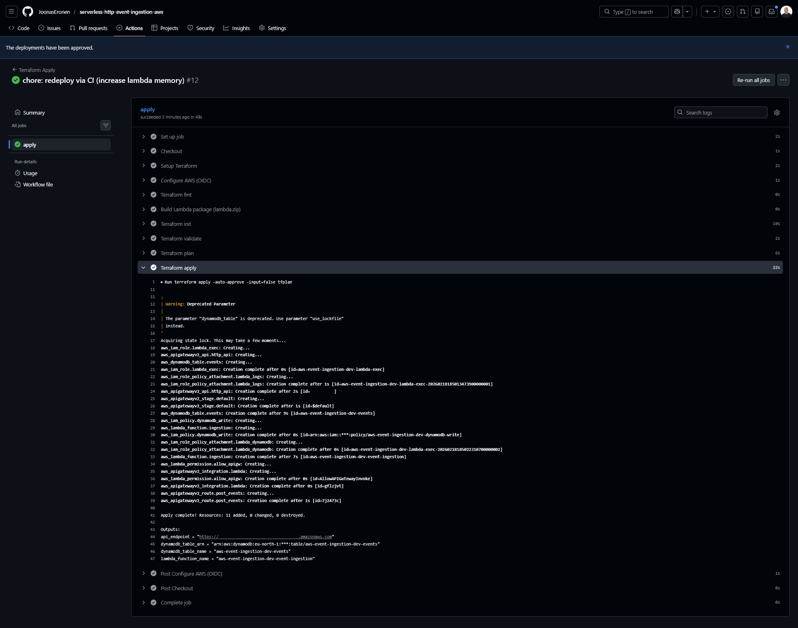
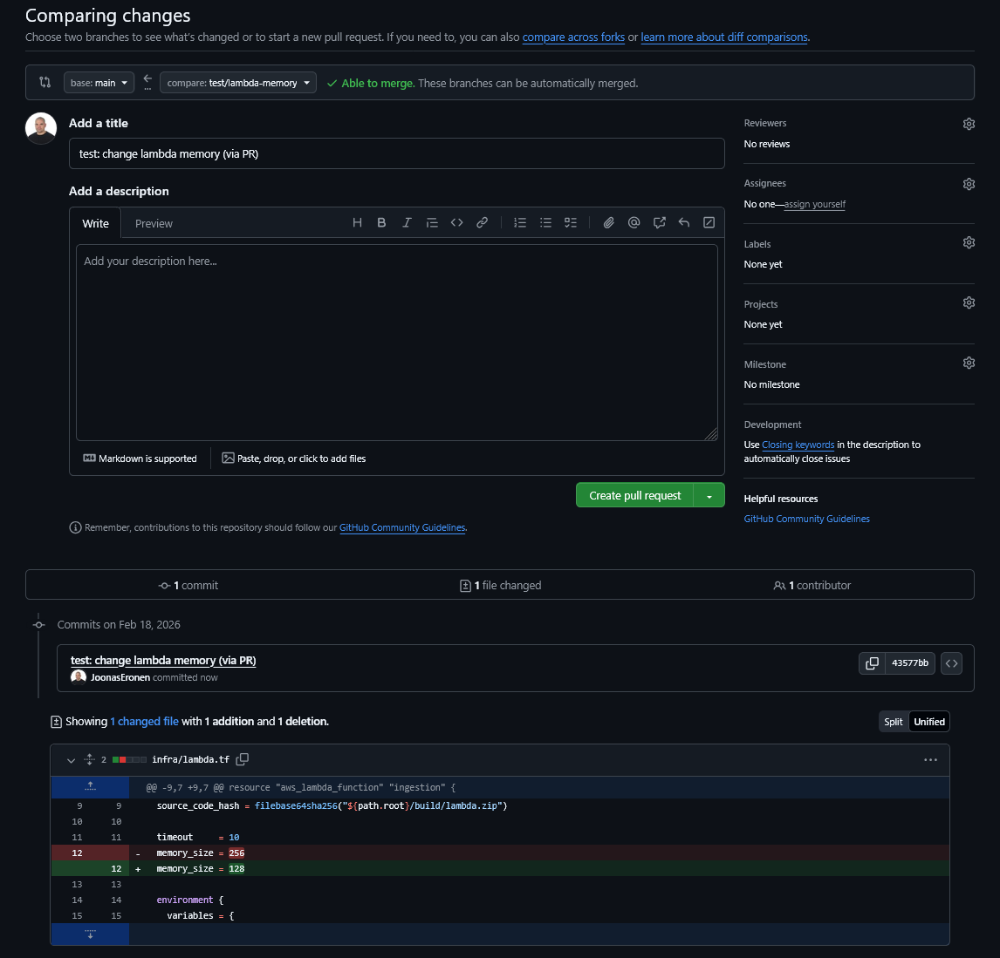

# Serverless HTTP Event Ingestion (AWS)

> **Project status**  
> Validated in AWS, with CI/CD validation and approval-gated deployment.  
> Infrastructure is reproducible and deployable on demand.  
> Demonstrates a production-style infrastructure workflow using Terraform and GitHub Actions.  
> Demonstrated multiple clean deploy cycles.

---

## Goal

Receive → validate → enrich → store HTTP events in a cost-efficient, serverless way.

This project demonstrates a realistic cloud backend pattern commonly used for:

- Third-party webhooks
- IoT / telemetry ingestion
- Application analytics events
- Audit and logging pipelines

The focus is on **clean architecture, cost awareness, automation, and extensibility**, not on building a full product.

---

## Architecture Overview

[View SVG version](docs/architecture/architecture-event-ingestion.svg)

### Flow

1. External system sends an HTTP `POST /events` request  
   *(In this project, the external webhook source is simulated using Postman.)*
2. Amazon API Gateway (HTTP API) receives the request
3. AWS Lambda:
   - validates the payload
   - enriches it with metadata (`event_id`, timestamp)
4. Amazon DynamoDB stores the raw event and metadata
5. Amazon CloudWatch collects structured logs and execution data

Later processing (analytics, replay, pipelines) is intentionally **out of scope**.

---

## Problem Statement

Build a simple, scalable backend that can receive HTTP events, perform lightweight validation, and persist them for later processing **without managing continuously running servers**.

This mirrors real-world ingestion systems where:

- Traffic is bursty
- Cost must scale with usage
- Infrastructure should stay minimal
- Observability is required for debugging

---

## First Principles Breakdown

### What is the simplest system that solves the problem?

1. **Public entry point**  
   A single HTTP endpoint external systems can call.

2. **Event-driven compute**  
   Logic that runs only when events arrive.

3. **Durable storage**  
   Events must be reliably stored for replay and later consumption.

4. **Observability**  
   Logs and traceability are required to verify correct behavior.

---

## Business Context

Many systems need a reliable way to receive events from external sources
(webhooks, devices, services) without tightly coupling those producers to internal systems.

Common challenges:

- Bursty and unpredictable traffic
- Cost inefficiency of always-on servers
- Tight coupling between producers and consumers
- Difficulty replaying or reprocessing events

This project models a minimal, decoupled ingestion layer that solves these problems
while keeping operational complexity low.

---

## Cost and Scaling Model

- No continuously running servers
- Compute billed only when events are processed
- Storage cost scales linearly with number of events
- Automatically scales with traffic

Suitable for:

- Low baseline traffic with occasional bursts
- Event-driven integrations
- Early-stage systems or internal tooling

---

## Design Decisions & Trade-offs

### API Gateway HTTP API (not REST API)
- Lower cost
- Lower latency
- Sufficient feature set for ingestion use case

### AWS Lambda
- No idle compute cost
- Automatic scaling
- Keeps API layer lightweight

### DynamoDB
- High write throughput
- No schema migrations
- Easy to extend with streams or replay patterns

---

## Infrastructure as Code

All infrastructure is defined using **Terraform**.

Provisioned resources:

- API Gateway (HTTP API)
- Lambda function and execution role
- DynamoDB table
- IAM policies and permissions
- Logging configuration

Principles:

- Reproducible deployments
- Least-privilege IAM
- Explicit tagging
- CI/CD workflow with automated validation and approval-gated apply

---

## CI/CD & Infrastructure Automation

This project is deployed exclusively via GitHub Actions using automated Terraform workflows.

The pipeline demonstrates a full infrastructure lifecycle:

- Clean deployment from empty state
- Controlled configuration changes via Pull Request
- Automated validation before merge
- OIDC-based authentication (no static AWS keys)
- Deterministic infrastructure state

---

### 1️⃣ Clean Deploy via CI (Infrastructure Rebuild)

After destroying the infrastructure, a fresh deployment was triggered via CI.

The deployment required environment approval before `terraform apply` was executed.

This run shows a full infrastructure creation:

- `11 added, 0 changed, 0 destroyed`
- Apply gated by manual approval
- All resources provisioned via Terraform
- No manual AWS Console interaction

This confirms the infrastructure is fully reproducible from code and deployed through a controlled release process.

---

### 2️⃣ Pull Request – Infrastructure Change Validation

A configuration change (Lambda memory update) was introduced via a feature branch.

Opening a Pull Request triggered:

- `terraform init`
- `terraform validate`
- `terraform plan`

The plan clearly shows the intended in-place update:

- `memory_size 256 → 128`

No infrastructure changes are applied before review and merge.

---

### 3️⃣ Merge to main – Controlled Apply

After approval and merge, the pipeline executed:

- `terraform apply`
- In-place update (`0 added, 1 changed, 0 destroyed`)
- OIDC authentication (no static credentials)

This demonstrates safe, review-driven infrastructure modification.

---

### Security Characteristics

- No long-lived AWS credentials stored in GitHub
- GitHub → AWS authentication via OIDC
- Least-privilege IAM roles for plan and apply
- All changes auditable via PR history
- Infrastructure rebuildable on demand

This models a production-style infrastructure delivery workflow.

---

## Proof of Deployment

The following screenshots demonstrate the complete end-to-end request flow.

---

### 1️⃣ HTTP Request (Simulated Webhook via Postman)

- `POST /events`
- JSON payload
- 200 OK response
- Returns `event_id` and `request_id`

---

### 2️⃣ Lambda Processing (CloudWatch Logs)

Structured log confirms:

- Event received
- `event_id` matches API response
- `request_id` matches API response
- Successful ingestion

---

### 3️⃣ Event Persisted (DynamoDB)

Stored item includes:

- event_id
- request_id
- payload
- received_at timestamp
- event type

This confirms full request → processing → persistence pipeline integrity.

---

## Operational Considerations

Basic operational visibility is provided via CloudWatch logs.

Traceability:

- request_id links API → Lambda → DynamoDB
- event_id uniquely identifies stored event
- Structured JSON logs for observability

In production, the system would typically add:

- Error rate alarms
- Throttling alarms
- Authentication and rate limiting
- Environment separation (dev / prod)

These are intentionally excluded to keep the system minimal and focused.

---

## Intentional Scope Limitations

Not included:

- Authentication and user management
- Frontend/UI
- Complex schema validation
- Real-time analytics pipelines
- Production SLAs and compliance hardening

This project is designed as a **foundational ingestion layer**, not a full product.

---

## Engineering Commentary

This project intentionally demonstrates:

- Infrastructure as Code using Terraform
- PR-based infrastructure validation
- CI/CD workflow with automated validation and controlled deployment
- Secure GitHub → AWS OIDC authentication
- Serverless cost-aware architecture
- Structured logging and traceability
- Clear trade-off decisions

While minimal in scope, the architecture models a realistic ingestion backend
that can serve as a foundation for production systems.

---

## Current State

- Validated in AWS and deployable via CI/CD
- Public HTTP API endpoint validated in AWS
- CI/CD automated via GitHub Actions
- Secure OIDC-based authentication
- End-to-end request flow verified
- All infrastructure defined as code

---

## Status

This project represents a completed baseline of a production-style, serverless ingestion backend with automated infrastructure delivery.